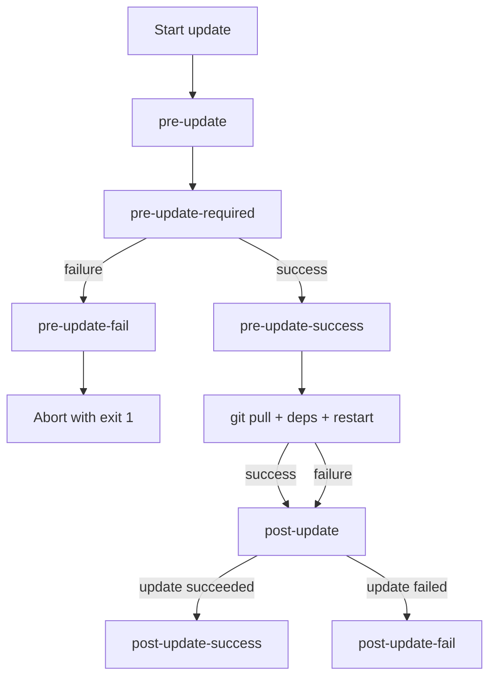

# Hooks

Hooks are shell commands defined in `deploy.yml` under a `hooks` key for a given
instance. They are executed remotely on `ssh_host` from the `~/<instance_name>`
working directory during the `update` command.

## Hook types

| Hook | When it runs | Blocks update on failure? |
|------|-------------|--------------------------|
| `pre-update` | Before any update step | No |
| `pre-update-required` | After `pre-update`; failure aborts the update | **Yes** |
| `pre-update-success` | After pre-update phase, only if all hooks succeeded | No |
| `pre-update-fail` | After pre-update phase, only if any hook failed | No |
| `post-update` | After update completes (success or failure) | No |
| `post-update-success` | After update, only if it succeeded | No |
| `post-update-fail` | After update, only if it failed | No |

## Configuration

```yaml
# deploy.yml
odoo-myproject-production:
  ssh_host: deploy@myserver.example.com
  hooks:
    pre-update:
      - ./scripts/check_disk_space.sh
      - ./scripts/notify_slack.sh "Update starting"
    pre-update-required:
      - ./scripts/run_tests.sh        # update is aborted if this fails
    pre-update-success:
      - ./scripts/notify_slack.sh "Pre-checks passed"
    pre-update-fail:
      - ./scripts/notify_slack.sh "Pre-checks failed"
    post-update:
      - ./scripts/smoke_test.sh
    post-update-success:
      - ./scripts/notify_slack.sh "Update succeeded"
    post-update-fail:
      - ./scripts/notify_slack.sh "Update failed"
```

## Execution order



## Skipping hooks

Pass `--ignore-hooks` to skip all hook execution:

```bash
deploy update odoo-myproject-production --ignore-hooks
```
